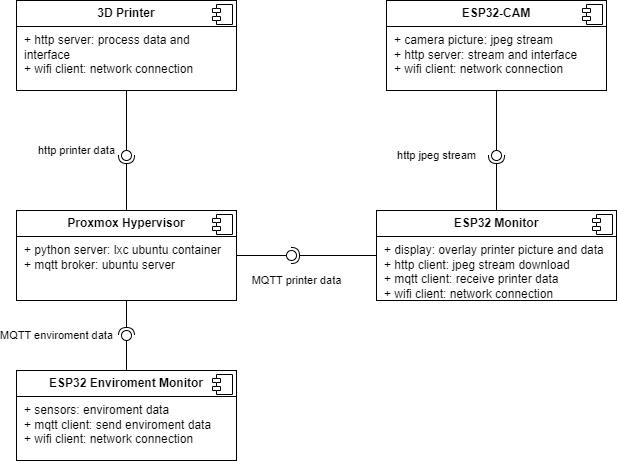
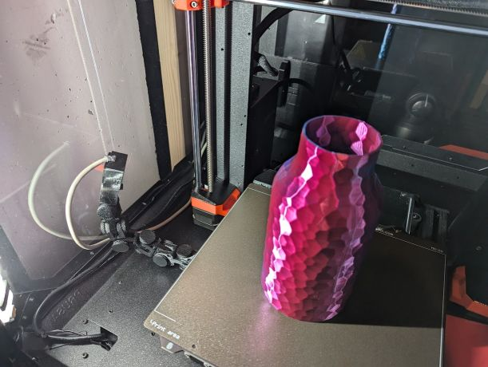
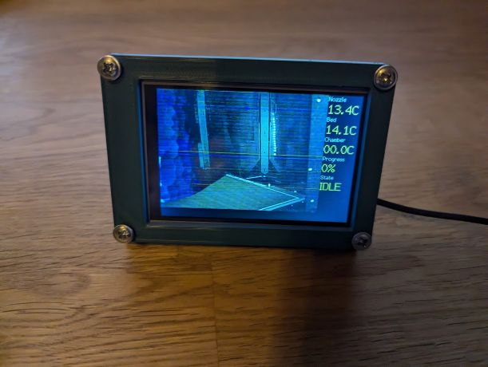
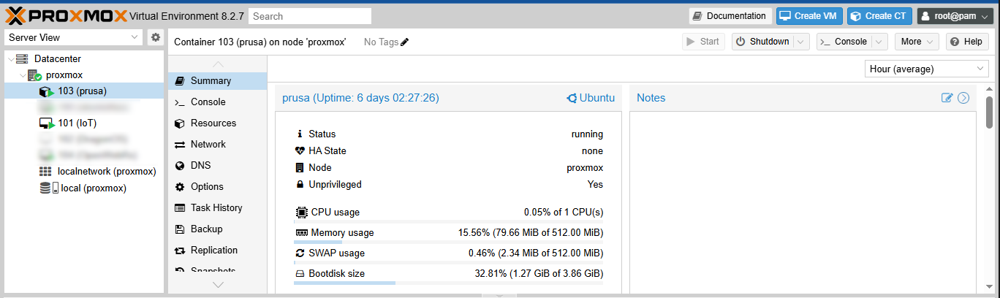
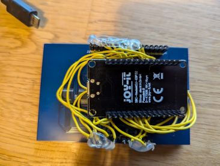

# PrinterViewer
View printer data on a smal screen on the desktop

# Overview

# Server Setup

## Proxmox lxc container
- created a lxc container on the proxmox hypervisor
- use ubuntu light template
- install python enviroment

### Python enviroment
- uses [PrusaLinkPy 2.2.1](https://pypi.org/project/PrusaLinkPy/) for Prusa MK4S printer connection

~~~
python3 -m venv venv
source venv/bin/activate
pip install prusaLinkPy
pip install requests
pip install gmqtt
~~~

### MQTT client installation test
~~~
import asyncio
from gmqtt import Client as MQTTClient

async def main():
    client = MQTTClient("my_gmqtt_client")
    await client.connect("192.168.xxx.xxx", 1883)
    client.publish("test/topic", b"Testnachricht")
    await client.disconnect()

if __name__ == "__main__":
    asyncio.run(main())
~~~

## MQTT broker
- created a VM on the proxmox hypervisor
- installed and configured ubuntu server
- installed and configured MQTT broker

# ESP32 Display

## Software
The software is inspired by: https://github.com/HWHardsoft/AZ-Touch-ESP_Video
- rework of structure and coding guide
- ported to VS Code
- added MQTT printer status overlay

### Setup
- Install Visual Studio Code
- Install Plugin PlatformIO
- Add folder to Workspace: esp32
- compile and flash with PlatformIO Tools (libraries and tools will be downloaded automatically)

## Hardware
- [NodeMCU ESP32](https://joy-it.net/de/products/SBC-NodeMCU-ESP32)
- [3,5" Display Shield für Arduino Uno / Mega](https://www.berrybase.de/en/3-5-display-shield-fuer-arduino-uno-mega)

# ESP32-CAM

## Software
- unmodified example firmware from Arduino IDE

## Hardware
- [ESP32-CAM Development Board inkl. OV2640 Kameramodul](https://www.berrybase.de/esp32-cam-development-board-inkl.-ov2640-kameramodul)

# ToDo
- create detailed installation instructuions
- configure a secure MQTT connection
- create Display schematic and provide tft-user-config header